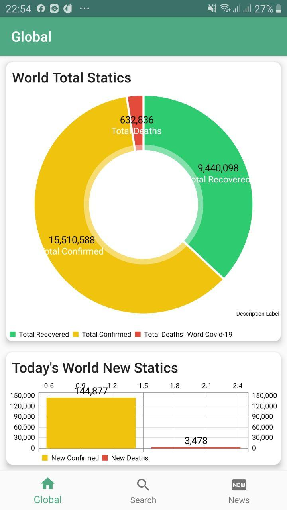
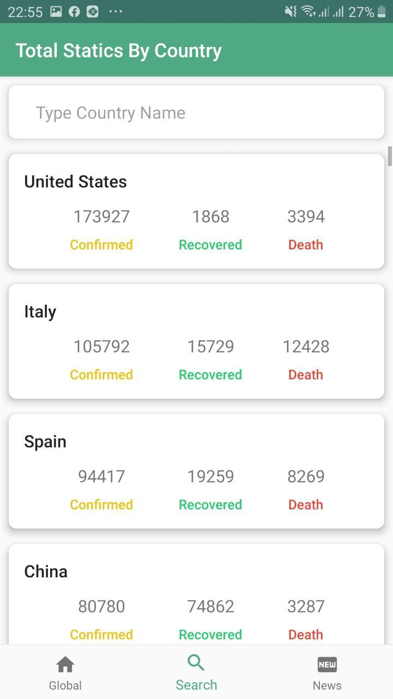

### Covid Tracker

This app is useful for someone who interested to know about the Covid-19 Virus around the world or specific countries.
With this, you can see the total status of the coronavirus globally or in your country and also you can read trend news
of COVID-19 around the world.

## Features
- Result of world statics of coronavirus in chart view (Total, Recovered, Deaths)
- The total result of a day (new Confirmed, New Deaths)
- The total result of coronavirus filtered by country 
- Latest trend news about coronavirus around the world
- Widget for trend news

## Libraries

- [View Binding](https://developer.android.com/topic/libraries/view-binding)
- [Architecture Components (View Models)](https://developer.android.com/topic/libraries/architecture)
- [MPAndroidChart](https://github.com/PhilJay/MPAndroidChart)
- [Retrofit (Networking Library)](https://square.github.io/retrofit/)
- [Picasso (image downloading and caching)](https://square.github.io/picasso/)
- [Dagger](https://dagger.dev)
- [Shimmer](https://github.com/facebook/shimmer-android)
- [RxBinding](https://github.com/JakeWharton/RxBinding)

## Screenshots

